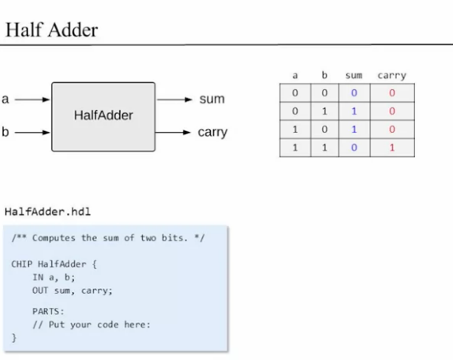
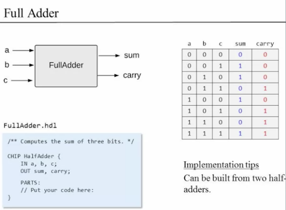
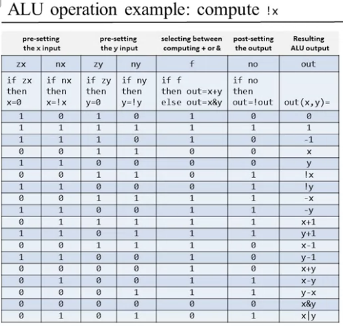
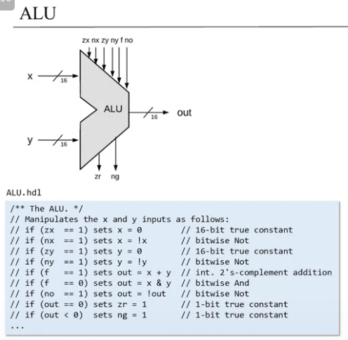

# NAND2TETRIS

კონსპექტი კურსისთვის - [Coursera](https://www.coursera.org/learn/build-a-computer)

[პირველი დავალება](https://github.com/peferron/nand2tetris/tree/master/01)
## კვირა 1 - Elementary Logic Gates
[Image Source](https://theorycircuit.com/basic-logic-gates-truth-table/)
### Nand (primitive)

AND + NOT

### Not

[YouTube](https://youtu.be/gI-qXk7XojA?t=170)

### And

[YouTube](https://youtu.be/gI-qXk7XojA?t=283)

### Or

[YouTube](https://youtu.be/gI-qXk7XojA?t=347)

### Xor

[YouTube](https://youtu.be/gI-qXk7XojA?t=437)

### Mux
### Dmux
### Not16
### And16
### Mux16
### Or8Way
### Mux4Way16
### Mux8Way16
### DMux4Way
### DMux8Way

---

HDL - Hardware Discribe Language
- [VHDL](https://en.wikipedia.org/wiki/VHDL)
- [Verilog](https://www.tutorialspoint.com/vlsi_design/vlsi_design_verilog_introduction.htm)
- ...
---

## კვირა 2 - Arithmetic-Logic Unit
დადებითი -  

უარყოფითი - 

y-x = y + (-x) \
გამოკლების მთავარი იდეა: \

იმისთვის რომ 4 გადავაქციოთ უარყოფითად, \
`1111` \
`-` \
`0100` \
`=` \
`1011` \
`+` \
`0001` \
`=` \
`1100 = 12 = -4`

---

## Binary Table
| Binary | Decimal | 
|:---:|:---:|
`0000` | `0` 
`0001` | `1` 
`0010` | `2` 
`0011` | `3` 
`0100` | `4` 
`0101` | `5` 
`0110` | `6` 
`0111` | `7` 
`1000` | `-8` (8)
`1001` | `-7` (9)
`1010` | `-6` (10)
`1011` | `-5` (11)
`1100` | `-4` (12)
`1101` | `-3` (13)
`1110` | `-2` (14)
`1111` | `-1` (15)

---
### Halfadder

### FullAdder (Regular adder)

### Add16
### Inc16
### ALU - Arthmetic Logic Unit

---
## კვირა 3 - Registers And Memory
### Bit
### Register
### RAM8
### RAM64
### RAM512
### RAM4K
### RAM16K
### PC
---
## კვირა 4 - Computer Architecture
### Memory
### CPU
### Computer
---
## კვირა 5 - Writing Low-Level Programs
---
## კვირა 6 - Developing An Assembler
